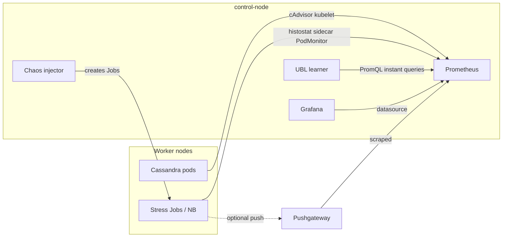

# Architecture Setup

Author: Irala Narasimhareddy Dilip Kumar (nirala@ncsu.edu)

This guide explains **how the platform is wired together** in this repository: namespaces, Kubernetes objects, the monitoring stack, image build and deploy order, and where to edit things when you extend the lab. It is written so a developer can trace **every major dependency** from manifest → runtime behavior.

The narrative matches the project report (LaTeX source: `reporting/ADS_Project_final_report.tex`; published PDF is the same document). Experiment **results** are not repeated here.

## Scope

- **Primary sources:** `k8s/`, `monitoring/`, `scripts/`, `Makefile`, `docker/`
- **Related docs:** `README.md` (end-to-end commands), `docs/stress-setup.md`, `docs/ubl-setup.md`, `docs/mitigation.md`, `docs/operations-and-troubleshooting.md`

## Repository map (where to look first)

| Area | Path | What you change |
|------|------|-------------------|
| Cluster namespace | `k8s/namespace.yaml` | `cassandra-lab` definition |
| Cassandra data plane | `k8s/cassandra/*.yaml` | StatefulSet replicas, affinity hostnames, resources, ConfigMap JVM/cluster options |
| Baseline load (optional) | `k8s/simulator/` | Simulator image, resources, config |
| UBL learner | `k8s/ubl-learner/*.yaml` | Image, env from ConfigMap, node affinity |
| Stress / NB control plane | `k8s/chaos-injector/*.yaml` | Image, `PROMPUSH_URL`, NB image/jar env, RBAC, scenario ConfigMaps, histostat PVC |
| Orchestrator job template | `k8s/orchestrator/` | Orchestrator image, ConfigMap defaults |
| Prometheus / Grafana | `monitoring/kube-prometheus-stack-values.yaml` | Scrape intervals, NodePorts, `extraManifests` (Pushgateway), node selectors |
| Scrape wiring | `monitoring/*podmonitor*.yaml`, `monitoring/cassandra-*.yaml` | Which pods expose `/metrics` or JMX |
| Strict deploy + checks | `scripts/deploy_strict_order.sh`, `Makefile`, `scripts/demo_preflight.sh` | Order of apply, preflight assumptions |
| Custom images | `simulator/`, `ubl-learner/`, `chaos-injector/`, `orchestrator/` Dockerfiles | Service code |
| Image refs in YAML | Patched via `scripts/set_dockerhub_images.py` | `docker.io/<user>/<image>:<tag>` across four manifests |

## Implementation goals

The architecture supports:

1. **Multi-node Cassandra** on Kubernetes with stable DNS identities (StatefulSet + headless Service).
2. **Prometheus-compatible scraping** of containers (cAdvisor/kubelet path), Cassandra JMX, and app `/metrics` (learner, chaos, simulator, NoSQLBench histostat sidecars).
3. **UBL learner** reading Tier-A series from Prometheus and exposing scores/alarms over HTTP.
4. **Chaos injector** creating short-lived Jobs (NoSQLBench and legacy paths) and persisting histostats where configured. Metrics are scraped by **Prometheus** (either directly from exporters/sidecars, or via Pushgateway).
5. **Optional closed loop** to scale Cassandra from scripts (see `docs/mitigation.md`).

## High-level topology

### Intended lab shape (report: VCL / k3s)

- **One control-oriented node** (`control-node` in manifests): Kubernetes control plane (on k3s this colocates server/agent), **monitoring stack** (Prometheus Operator, Grafana, Alertmanager, kube-state-metrics, node-exporter, Pushgateway), **control services** (UBL learner, chaos injector, optional simulator) and **ephemeral stress Jobs** scheduled where cluster capacity allows.
- **Multiple workers** (`worker-1`, `worker-2`, …): **Cassandra** StatefulSet pods, anti-affinity across hostnames.

This separation keeps heavy CQL and compaction work off the same node that runs Prometheus query fan-out and Grafana, at least in the **pedagogical** layout. Your real node names **must** match `kubectl get nodes`; all `nodeAffinity` / `nodeSelector` blocks are literal hostnames.

### Namespaces

| Namespace | Role |
|-----------|------|
| `cassandra-lab` | Cassandra, simulator, learner, chaos injector, orchestrator ConfigMap/Job, stress Jobs, NB PVCs |
| `monitoring` | `kube-prometheus-stack` release, PodMonitors, extra push/metrics backends |

## Kubernetes distribution

The report standardizes on **k3s**: CNCF-compatible API, bundled CNI, lower ops overhead than full kubeadm for **VM-sized** labs. The repo does not ship k3s install scripts in the main path; operators install k3s (or another Kubernetes) and join agents with consistent **`--node-name`** values so manifests stay valid.

**Why node names are baked in:** `k8s/cassandra/cassandra-statefulset.yaml` uses `requiredDuringSchedulingIgnoredDuringExecution` node affinity on `worker-1` and `worker-2`, optional fourth-node comments for scale demos, and **required** `podAntiAffinity` on `kubernetes.io/hostname`. If your VCL inventory uses different hostnames, **edit the StatefulSet** (and the same for `control-node` in learner/chaos/monitoring values) before `kubectl apply`.

## Core Kubernetes resources (file-by-file)

### Namespace

- **`k8s/namespace.yaml`** — creates `cassandra-lab`. Applied first by `make deploy-core`.

### Cassandra

| File | Purpose |
|------|---------|
| `k8s/cassandra/cassandra-statefulset.yaml` | `replicas: 3`, `serviceName: cassandra`, **affinity** (workers only), **topologySpreadConstraints**, container `cassandra:4.1`, seeds via `CASSANDRA_SEEDS` pointing at `cassandra-0...`, long `terminationGracePeriodSeconds` for drain |
| `k8s/cassandra/cassandra-service.yaml` | **Headless** service for stable pod DNS `cassandra-0.cassandra.cassandra-lab.svc.cluster.local` |
| `k8s/cassandra/cassandra-client-service.yaml` | Non-headless entry for clients that want a single Service IP |
| `k8s/cassandra/cassandra-config.yaml` | Cluster name, DC, rack, snitch, heap sizes |

**Storage:** the StatefulSet uses volumeClaimTemplates (default size in YAML; comments in repo mention 10Gi). With **local-path** (common on k3s), PVCs bind to a **specific node**. If you change affinity or recycle a node, a pod can sit **Pending** until the PVC is deleted or the node matches again. The StatefulSet comments point at this failure mode.

**Monitoring patch:** `make deploy-monitoring` runs `kubectl patch statefulset cassandra ... --patch-file monitoring/cassandra-statefulset-patch.yaml` to add the JMX exporter **sidecar** and volume mounts expected by `monitoring/cassandra-jmx-configmap.yaml`.

### Simulator (optional baseline load)

- **`k8s/simulator/`** — Deployment + Service + ConfigMap. Included in `make deploy-core`. Strict preflight expects this pod to exist. If you do not need synthetic load, you still need the Deployment **Ready** for current preflight, or adjust `scripts/demo_preflight.sh`.

### UBL learner

- **`k8s/ubl-learner/ubl-learner-config.yaml`** — non-secret tunables (`PROMETHEUS_BASE`, `CASSANDRA_PODS`, SOM sizes, streaks, snapshot path, …).
- **`k8s/ubl-learner/ubl-learner-deployment.yaml`** — image, `envFrom` ConfigMap, **`nodeAffinity: control-node`**, port `8100`.
- **`k8s/ubl-learner/ubl-learner-service.yaml`** — ClusterIP for in-cluster HTTP.

**Developer note:** learner PromQL for Tier-A assumes `TARGET_NAMESPACE` and pod names match live Cassandra pods (see `docs/ubl-setup.md`).

### Chaos injector

Applying **`kubectl apply -f k8s/chaos-injector/`** installs, in dependency order:

| File | Purpose |
|------|---------|
| `chaos-injector-rbac.yaml` | `ServiceAccount`, Role/RoleBinding so the injector can **create/delete Jobs**, ConfigMaps, etc. in `cassandra-lab` |
| `chaos-nosqlbench-scenarios-configmap.yaml` | NB scenario YAML snippets consumed by `chaos-injector/main.py` |
| `nosqlbench-histostats-exporter-configmap.yaml` | Sidecar exporter config for histostat CSV → Prometheus text |
| `nosqlbench-histostats-pvc.yaml` | Shared PVC name referenced by NB Jobs for histostat persistence |
| `university-profile-configmap.yaml` | Legacy cassandra-stress user profile (also created from repo file by `Makefile` during `deploy-mvp`) |
| `chaos-injector-deployment.yaml` | Control service on **8200**, `PROMPUSH_URL` (Pushgateway), `NOSQLBENCH_*` env, histostat toggles |
| `chaos-injector-service.yaml` | ClusterIP API |

**Changing stress behavior:** most edits are in **`chaos-injector/main.py`** and **`k8s/chaos-injector/chaos-nosqlbench-scenarios-configmap.yaml`**, then rebuild/push the chaos image.

### Orchestrator

- **`k8s/orchestrator/orchestrator-config.yaml`** — defaults for scripted runs.
- **`k8s/orchestrator/orchestrator-job.yaml`** — **Job** template image for `orchestrator/` (often run from laptop instead; the Job exists for in-cluster automation patterns).

## Monitoring stack (Helm + custom manifests)

### Helm release

`scripts/deploy_strict_order.sh` runs:

```bash
helm upgrade --install kube-prom-stack prometheus-community/kube-prometheus-stack \
  -n monitoring \
  -f monitoring/kube-prometheus-stack-values.yaml
```

Important knobs in **`monitoring/kube-prometheus-stack-values.yaml`** (read this file when debugging scrape timing):

- **Node selectors:** YAML anchor `platform_node` pins Grafana, Prometheus, Alertmanager, operator, kube-state-metrics to **`kubernetes.io/hostname: control-node`** (must exist).
- **Scrape cadence:** `prometheus.prometheusSpec.scrapeInterval` and `evaluationInterval` are set to **1s** for lab responsiveness (higher load than production defaults).
- **Grafana:** NodePort **32000**, default admin password in values (change for real use).
- **Prometheus:** NodePort **32090**.
- **`extraManifests`:** in-chart objects for **Pushgateway** (Deployment + Service + ServiceMonitor, `honorLabels: true`).

**Prometheus-only note:** this repo assumes **Prometheus** is the only metrics backend. For NoSQLBench or other short-lived Jobs, prefer:

- export metrics via a sidecar and scrape with a `PodMonitor`/`ServiceMonitor`, and/or
- push transient metrics to **Pushgateway**, which Prometheus then scrapes.

### After Helm: Cassandra JMX and PodMonitors

`make deploy-monitoring` (from `Makefile`) runs:

1. `kubectl apply -f monitoring/cassandra-jmx-configmap.yaml`
2. `kubectl patch statefulset cassandra -n cassandra-lab --patch-file monitoring/cassandra-statefulset-patch.yaml`
3. `kubectl apply -f monitoring/cassandra-podmonitor.yaml`
4. `kubectl apply -f monitoring/simulator-podmonitor.yaml`
5. `kubectl apply -f monitoring/ubl-learner-podmonitor.yaml`

**Not applied by the current Makefile target** (add these to `Makefile` or run manually when you need scrape targets):

```bash
kubectl apply -f monitoring/chaos-injector-podmonitor.yaml
kubectl apply -f monitoring/nosqlbench-histostats-podmonitor.yaml
```

Without the NoSQLBench PodMonitor, **histostat sidecar** series may not appear in Prometheus targets for completed/short-lived Jobs depending on your operator settings.

### Grafana dashboards

- `monitoring/grafana-dashboard-cassandra-lab.yaml` and `monitoring/grafana-dashboards/cassandra-lab-demo.json` provision a lab dashboard via sidecar label `grafana_dashboard: "1"` (see values file).

## Service discovery and networking

- **Pod DNS:** `cassandra-0.cassandra.cassandra-lab.svc.cluster.local` (headless Service `cassandra`).
- **Client Service:** use `cassandra-client` (or the name in `cassandra-client-service.yaml`) when a single virtual IP is enough; drivers still learn topology from peers.
- **In-cluster HTTP:** `http://ubl-learner.cassandra-lab.svc.cluster.local:8100`, `http://chaos-injector.cassandra-lab.svc.cluster.local:8200`.
- **Prometheus inside cluster:** ConfigMap default in learner often uses `kube-prom-stack-kube-prome-prometheus.monitoring.svc.cluster.local:9090` (Helm-generated name); confirm with `kubectl -n monitoring get svc`.

**From a laptop:** use `kubectl port-forward` (see root `README.md`) because ClusterIPs are not routable off-cluster.

## Access patterns (ports)

| Entry | Typical access |
|-------|----------------|
| Grafana | NodePort **32000** on a node where the Service routes, or port-forward to Grafana pod |
| Prometheus | NodePort **32090**, or port-forward |
| Learner / chaos / simulator | ClusterIP — **port-forward** `8100` / `8200` / `8080` |

## Metrics and control-plane data flow



## Image build, tag, and manifest wiring

1. **Build** local names (`Makefile` `build-images`): `cassandra-simulator:latest`, `cassandra-ubl-learner:latest`, `cassandra-chaos-injector:latest`, `cassandra-orchestrator:latest`.
2. **Tag and push** (`make push-images DOCKERHUB_USER=... IMAGE_TAG=...`).
3. **Rewrite Kubernetes image references** so Deployments/Jobs pull your registry user/tag:

```bash
python3 ./scripts/set_dockerhub_images.py --user <your_user> --tag <your_tag> --root .
```

This regex-updates **`docker.io/<user>/<repo>:`** in:

- `k8s/simulator/simulator-deployment.yaml`
- `k8s/ubl-learner/ubl-learner-deployment.yaml`
- `k8s/chaos-injector/chaos-injector-deployment.yaml`
- `k8s/orchestrator/orchestrator-job.yaml`

## Bring-up sequence (what actually runs)

From repo root **`cassandra/`**:

```bash
make build-images
make push-images DOCKERHUB_USER=<your_user> IMAGE_TAG=<your_tag>
python3 ./scripts/set_dockerhub_images.py --user <your_user> --tag <your_tag> --root .
bash ./scripts/deploy_strict_order.sh
make demo-preflight   # optional repeat if cluster still warming
```

`scripts/deploy_strict_order.sh` does:

1. **`make deploy-core`** — `namespace` + `k8s/cassandra/` + `k8s/simulator/`
2. **Helm** kube-prometheus-stack into `monitoring` with `monitoring/kube-prometheus-stack-values.yaml`
3. **`make deploy-monitoring`** — JMX configmap, StatefulSet patch, three PodMonitors (Cassandra, simulator, learner)
4. **`make deploy-mvp`** — learner manifests, `chaos-university-stress-profile` ConfigMap from file, **entire** `k8s/chaos-injector/` directory, orchestrator ConfigMap
5. **`make demo-preflight`** — `scripts/demo_preflight.sh`

### Why order matters

- Cassandra must exist before JMX patch and before stress Jobs.
- Prometheus Operator must exist before PodMonitors are accepted (CRD installed).
- Learner needs a reachable **`PROMETHEUS_BASE`** and correct **`CASSANDRA_PODS`**.
- Chaos injector needs RBAC + scenario ConfigMaps before API calls succeed.

### What strict preflight enforces

`scripts/demo_preflight.sh`:

- Rejects kube contexts matching `docker-desktop` or `kind` by default (avoids mistaken “strict distributed” runs on single-node sandboxes).
- Requires **≥ 3 Ready worker nodes** (lines exclude control-plane/master role labels).
- Requires `cassandra-lab` namespace, StatefulSet desired replicas created, **≥ 3 distinct nodes** for Cassandra pods, **`nodetool status`** with ≥ 3 **UN** lines.
- Checks simulator, learner, chaos pods listed.
- Lists PodMonitors matching `cassandra|simulator` — **does not** currently assert chaos or NB PodMonitors.

Adjust `EXPECTED_WORKERS` or the context regex if your lab topology differs.

## Docker Compose path (`docker/`)

`docker/docker-compose.yml` brings up three Cassandra containers and a built **simulator** on a user-defined bridge. Use it for **quick wiring checks** only: it is **not** the k3s strict path, not covered by `demo_preflight.sh`, and does not install Prometheus operator behavior.

## Closed-loop mitigation (pointer)

Architecture allows scripts to poll learner/Prometheus and patch StatefulSet replicas. Implementation and PromQL live in **`docs/mitigation.md`** and `scripts/cassandra_elastic_replicas.sh`.

## Verification commands (quick)

```bash
kubectl get ns
kubectl get nodes -o wide
kubectl -n cassandra-lab get pods,svc -o wide
kubectl -n monitoring get pods,svc
kubectl -n monitoring get podmonitor
kubectl get crd | rg prometheusmonitor
```

## Architecture validation checklist

1. Node hostnames match **all** `nodeAffinity` / `nodeSelector` blocks (Cassandra, monitoring, learner, chaos).
2. Cassandra **UN** count matches expectations; pods spread across workers.
3. Prometheus **Targets** UI: Cassandra JMX, cAdvisor paths, learner, simulator; add chaos/NB PodMonitors if missing.
4. Learner `/status` shows Prometheus reachable and sane `last_tier_a_coverage`.
5. Chaos `/health` and a dry NB profile start (see `docs/stress-setup.md`).
6. Disk free on workers after long stress (PVC + SSTable growth).

---

## Earlier setups and challenges (from the project report)

The following summarizes **Section: Limitations and Challenges** in `reporting/ADS_Project_final_report.tex` (same content as the PDF `ADS_Project_Final_Report.pdf`). It documents **why** the current k3s + VCL layout and tooling choices exist—not lab scores.

### Infrastructure and platform history

**Early Multipass topology (legacy)**

- The team first ran several **Multipass** VMs on **one physical host**.
- **Symptom:** CPU, RAM, disk, and network were all contended on a single machine, so latency spikes were hard to attribute to Cassandra vs hypervisor scheduling vs Kubernetes control plane overhead.
- **Lesson:** single-host multinode is fine for **wiring demos**, but saturated-host effects can dominate measurements unless you model ceilings explicitly.

**Remote access and Tailscale (legacy / home-lab)**

- Driving `kubectl` from a laptop over **Tailscale** into a home API server sometimes produced **split-path** failures: API reachable, but **CoreDNS**, **NodePort**, or **ClusterIP** paths flaky due to host or upstream firewall rules (UDP/TCP differences, hairpin NAT).
- **Symptom:** Pods schedule, but Jobs cannot resolve `*.svc.cluster.local`, or port-forwards flap.
- **Mitigations (conceptual):** open CNI/kube-proxy ports, run `kubectl` from a bastion on the same L3 domain as workers, or fix VPN routing—not “Kubernetes bugs” alone.

**AWS as an alternative**

- AWS EKS-style clusters would normalize networking and DNS but add **account, VPC, node group, cost** overhead; the project biased toward **institutional VCL** for bursty student usage.

**Migration to NCSU VCL (current direction)**

- VCL VMs gave more predictable **campus networking** than ad-hoc home routing.
- **Residual friction:** university images may ship **restrictive firewalls**; **SSH allowed ≠ pod east-west CQL allowed**; opening NodePorts or scrape paths may need tickets.
- **DNS paper cuts:** resolver TTLs, upstream forwarding, timeouts when control plane is busy during Job churn and StatefulSet rolls—workarounds included longer driver timeouts, verifying headless **Endpoints** before stress, checking **`ndots`** / search paths in `resolv.conf`.

**Affinity and topology drift**

- **Required** anti-affinity / spread rules can leave pods **Pending** if the cluster is smaller than the intended fault domain; **preferred** rules schedule but may violate the “pretty diagram” layout.
- **Node replacement** changes labels/hostnames → manifests must be updated (`kubectl get nodes` first).

**Disk and PVC hygiene**

- Repeated stress fills SSTables, commitlogs, histostat data, Job logs. **local-path** / small root disks → kubelet eviction, GC of images, **flaky scrapes**.
- Operational discipline: delete or recycle PVCs where safe, truncate known dirs, or recycle nodes between long campaigns.

### Stress and observability methodology challenges

**Resource orthogonality**

- “Disk-only” or “CPU-only” **CQL write** stress still touches CPU, memory, commitlog, flush, and compaction. Clean single-channel attribution often needs **extra instrumentation** (CPU burn sidecars, cgroup limits, throttling)—not profile names alone.

**Short CPU spikes vs scrape cadence**

- Spikes shorter than scrape visibility are hard to align with Prometheus series; tuning duration and parallelism vs scrape alignment becomes empirical.

**Memory metrics under Kubernetes**

- cgroup RSS stays high after JVM warmup; not always a “leak.” Memory-channel UBL alarms need context (GC logs, heap, pools).

**Baseline housekeeping vs anomalies**

- GC pauses, compaction, background tasks create **normal spikes**. A tight SOM + short streak → false positives; the report motivated **longer baselines**, **smoothing**, and evaluation windows **W** that tolerate brief benign excursions.

**cassandra-stress log parsing (deprecated path)**

- Early SLO proxies parsed **stress text logs** → brittle, high volume, lost on pod restart, bad lead-time alignment.
- **NoSQLBench + histostats + metrics sidecar** is the maintained “first-class metrics” path (see `docs/stress-setup.md`).

### Mitigation and evaluation challenges

**Cold start after scale-out**

- New Cassandra pods need **bootstrap, JVM warmup, gossip, readiness probes**—tens of seconds in lab conditions—before load shifts. Mitigation timelines must separate **scheduling** from **ready-to-serve**.

**Coarse polling in scripts**

- If mitigation or evaluation scripts poll Prometheus too slowly, sub-minute recovery dynamics are missed—reporting should state **scrape interval** and **probe semantics**.

### Team note (distribution of work, from report)

The report’s **Distribution of Work** section credits: Multipass/Tailscale/networking stress and mitigation (Aum); UBL training/inference and evaluation metrics (Darsh); current VCL k3s, AWS exploration, networking, Prometheus/Grafana (Dilip); integration and documentation (ALL). Use that section if you need formal attribution beyond this doc’s author line.
